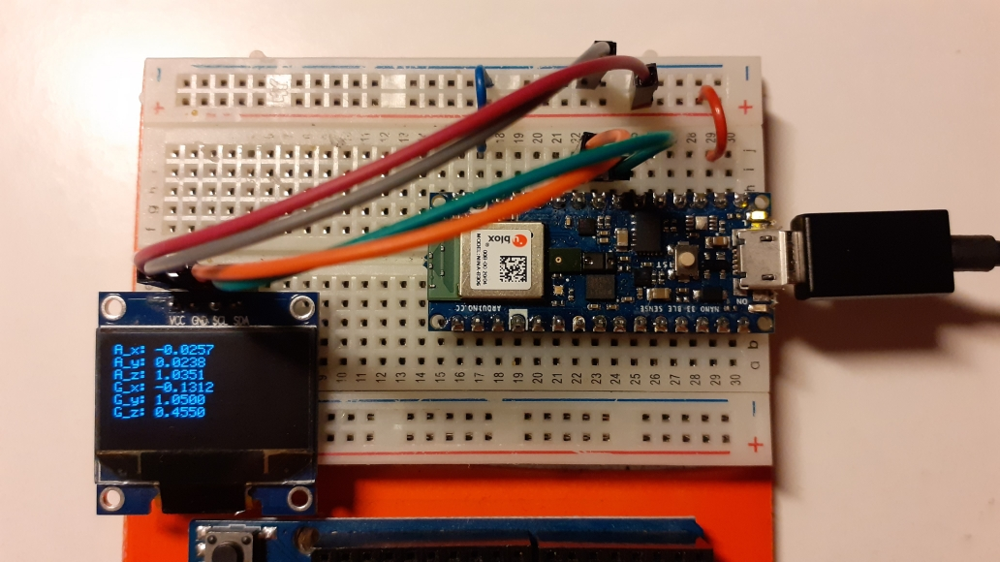

### LSM9DS1 accelerometer and gyroscope readings displayed to SSD1306 OLED

Ported to Arduino 33 BLESense board (https://store.arduino.cc/arduino-nano-33-ble-sense). 

According to the schematics (https://content.arduino.cc/assets/NANO33BLE_V2.0_sch.pdf) the LSM9DS1 sensor is powered from the VDD_ENV line, which is connected to pin P0.22. Said pin has to be set HIGH. Pin P1.00 also has to be set HIGH, as it is connected to R_PULLUP for the SDA1/SCL1 signals. 

_TO DO_:
* refresh sensor readings with an interrupt or with RTIC, not in a busy loop
* use the readings for something else than just plain value display




#### HOW TO FLASH:

* build the code: ```cargo build --release```
* convert to .hex file: ```arm-none-eabi-objcopy -O ihex target/thumbv7em-none-eabihf/release/blinky blinky.hex```
* create a dfu package: ```adafruit-nrfutil dfu genpkg --dev-type 0x0052 --application blinky.hex blinky.zip```
* put the board into bootloader mode (double click on reset button, will show up as _NANO33BOOT_ or similar)
* flash the firmware: ```adafruit-nrfutil dfu serial --package blinky.zip -p /dev/ttyACM0 -b 115200```


#### HOW TO FLASH ADAFRUIT BOOTLOADER:

In order to flash code with nrfutil, Adafruit bootloader has to be flashed onto the board. Two wires need to be attached to the pads on the bottom side of the board (SWDIO and SWCLK).

* step 1: clone the repo from https://github.com/adafruit/Adafruit_nRF52_Bootloader
and build with `make BOARD=arduino_nano_33_ble all`
* step 2: flash using Black Magic Probe and GDB: \
`gdb` \
`target extended-remote /dev/ttyACM0` \
`monitor swdp_scan` \
`attach 1` (Nordic nRF52 M4) \
`load arduino_nano_33_ble_bootloader-0.4.0-2-g4ba802d_s140_6.1.1.hex` \
`kill`